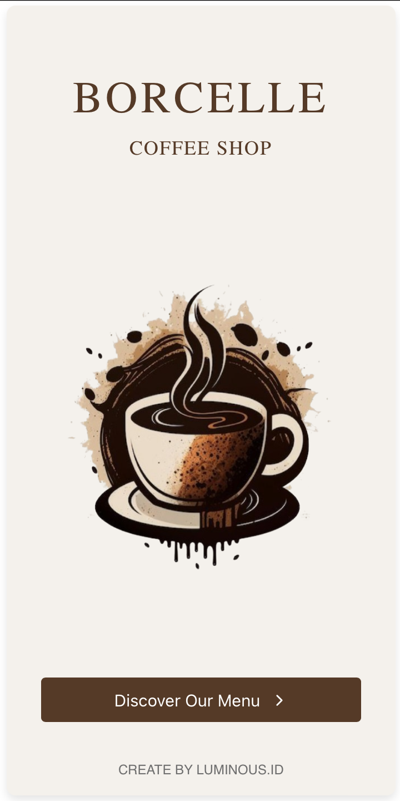
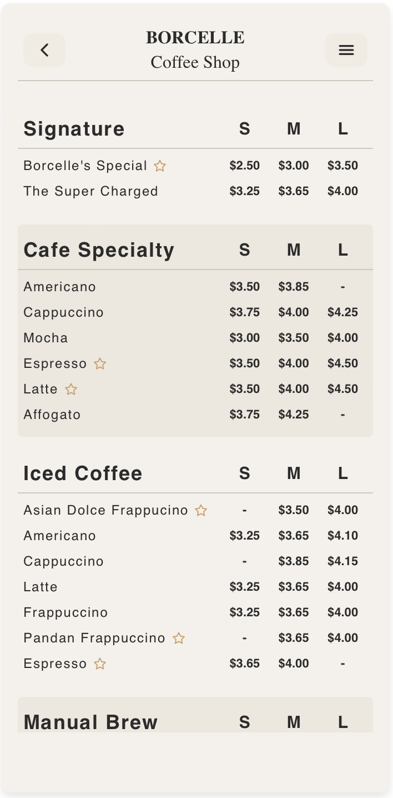

# Digital Menu Web App Packages "STANDARD"

## Digital Menu Website Packages

Modern and responsive digital menu solutions for coffee shops, restaurants, cafés, and culinary businesses that want to grow with a more digital customer experience.

## Package Overview

This project provides three service packages based on business needs:

Basic Package → Simple & clean digital menu
Standard Package → Interactive menu with search feature
Premium Package → Full experience with advanced customization

Perfect for:

* Coffee Shops
* Restaurants
* UMKM Culinary Businesses
* Beverage Brands
* Modern Café Concepts
  
## 🖼️ Preview

> Simple, elegant interface inspired by modern cafe experiences.

* Welcome screen with branding
* Interactive menu list
---

## THIS PACKAGE [Basic Package]


Perfect for businesses that need a clean and simple digital menu.

### What you'll get from this package
* two page of (welcome, and menu list)
* responsive digital menu
* match with your brand color

### Features
* Responsive Digital Menu
* Menu Categories
* Modern UI Design
* Mobile Friendly Layout
* Contact Information Section
* Easy-to-Edit Menu Data
* Fast Loading Website

### Suitable For
* Small cafés
* Street food brands
* Simple restaurant menus
* Businesses starting their digital presence

## 🛠️ Tech Stack

* ⚛️ React.js
* 🎨 CSS (Custom styling)
* 📦 Vite / Create React App (depending on setup)

---

## 🚀 Getting Started

### 1. Clone the repository

```bash
git clone https://github.com/widyawulan19/standard-package.git
cd standard-package
```

---

### 2. Install dependencies

```bash
npm install
```

---

### 3. Run development server

```bash
npm start
```

or (if using Vite):

```bash
npm run dev
```

---

### 4. Open in browser

```bash
http://localhost:3000
```

---

## 📱 Testing on Mobile (Recommended)

To test the app directly on your phone:

1. Make sure your phone & laptop are on the same WiFi
2. Find your local IP:

   ```bash
   ifconfig
   ```
3. Open in your phone browser:

   ```bash
   http://YOUR_IP:3000
   ```

---

## 📂 Project Structure

```
src/
│
├── components/
├── pages/
├── data/
├── styles/
└── App.jsx
```

---

## 💡 Future Improvements

* 🛒 Add cart & ordering system
* 🔐 Authentication (Admin & User)
* 🧾 Order history
* 🌐 Backend integration (API)
* 📊 Dashboard for admin

---

## 🤝 Contributing

Feel free to fork this project and improve it!
Pull requests are welcome.

---

## 📄 License

This project is open-source and available under the MIT License.

---


## LIVE PREVIRW / Deploy link 
https://light-menu-digital.vercel.app/

## Preview 



