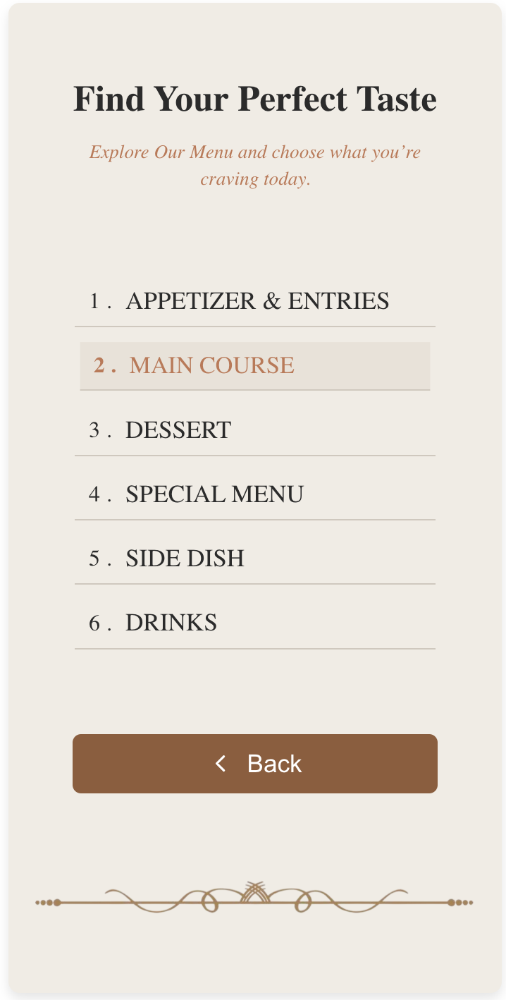

# Digital Menu Web App — Restaurant Edition "THE LOCAL"

A modern, mobile-first digital menu web app designed to deliver a seamless, app-like experience directly from the browser.

Built for restaurants and cafés, this solution transforms traditional menu displays into a clean, interactive, and user-friendly digital experience.

---

## Problem Statement

Many restaurants still rely on static menu displays such as image-based menus stored in platforms like Google Drive or posted on social media.

This approach creates several usability issues:

* Menu presented as images instead of structured data
* Users must zoom in and out to read items clearly
* Difficult to browse or find specific menu items
* Poor mobile experience (not responsive)
* No categorization or smooth navigation
* No scalability for menu updates (price/menu changes)

As a result, the customer experience becomes inefficient and less engaging.

---

## ✨ Solution

This project transforms traditional menus into a modern digital product:

*  Mobile-first, app-like interface
*  Category-based navigation (Appetizer, Main Course, Dessert, Beverages)
*  Structured and easy-to-read menu layout
*  Fast and responsive performance
*  Focused UX: Browse menu quickly without friction
*  Ready for integration (WhatsApp, location, etc.)


## User Flow

Designed with simplicity and usability in mind:

* Welcome Page
   → Intro & branding of the restaurant
* Choose Menu
   → Users select menu categories (e.g. Appetizer, Main Course, Drinks)
* Menu Page
   → Display menu items with:
   ** Name
   ** Description
   ** Price / Ice & Hot variants (for beverages)

---

## Key Features
* Clean typography-based design (no dependency on images)
* Supports both:
* Standard pricing (food)
* Variant pricing (ice / hot drinks)
* Lightweight and fast loading
* Easy to customize for different restaurants
* Scalable structure for future features


## Why This Matters

This digital menu is not just a UI — it's a product solution for small businesses:

* Improves customer experience
* Speeds up menu browsing
* Makes the business look more modern & professional
* Easy to update compared to static image menus
---

## 🖼️ Preview

> Simple, elegant interface inspired by modern cafe experiences.

* Welcome screen with branding
* Menu selection page
* Interactive menu list

---

## 🛠️ Tech Stack

* ⚛️ React.js
* 🎨 CSS (Custom styling)
* 📦 Vite / Create React App (depending on setup)

---

## 🚀 Getting Started

### 1. Clone the repository

```bash
git clone https://github.com/widyawulan19/bold-menu-digital.git
cd bold-menu-digital
```

---

### 2. Install dependencies

```bash
npm install
```

---

### 3. Run development server

```bash
npm start
```

or (if using Vite):

```bash
npm run dev
```

---

### 4. Open in browser

```bash
http://localhost:3000
```

---

## 📱 Testing on Mobile (Recommended)

To test the app directly on your phone:

1. Make sure your phone & laptop are on the same WiFi
2. Find your local IP:

   ```bash
   ifconfig
   ```
3. Open in your phone browser:

   ```bash
   http://YOUR_IP:3000
   ```

---

## 📂 Project Structure

```
src/
│
├── components/
├── pages/
├── data/
├── styles/
└── App.jsx
```

---

## 💡 Future Improvements

* 🛒 Add cart & ordering system
* 🔐 Authentication (Admin & User)
* 🧾 Order history
* 🌐 Backend integration (API)
* 📊 Dashboard for admin

---

## 🤝 Contributing

Feel free to fork this project and improve it!
Pull requests are welcome.

---

## 📄 License

This project is open-source and available under the MIT License.

---


## LIVE PREVIRW / Deploy link 
https://light-menu-digital.vercel.app/

## Preview 




